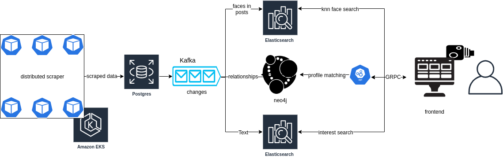

# Social Record

> Distributed scraping and analysis pipeline for a range of social media platforms

[**Shields**](https://shield.io)

[](https://github.com/codeuniversity/smag-mvp/graphs/contributors)
[](https://github.com/codeuniversity/smag-mvp/pulse/monthly)

[](#)
[](https://circleci.com/gh/codeuniversity/smag-mvp)


**Table of content**

- [About](#about)
- [Architectural overview](#architectural-overview)
- [Further reading](#further-reading)
  - [Detailed documentation](#detailed-documentation)
  - [Wanna contribute?](#wanna-contribute)
  - [List of contributors](#list-of-contributors)
  - [Deployment](#deployment)
- [Getting started](#getting-started)
  - [Requirements](#requirements)
  - [Preparation](#preparation)
  - [Scraper](#scraper)

## About

The goal of this project is to raise awareness about data privacy. The mean to do so is a tool to scrape, combine and analyze public data from multiple social media sources. <br>
The results will be available via an API, used for some kind of art exhibition.

## Architectural overview



You can find an more detailed overview [here](https://drive.google.com/a/code.berlin/file/d/1uE8oTku322-_eN3QGuiM4ayWZiRXfn9F/view?usp=sharing). <br>
Open it in draw.io and have a look at the different tabs "High level overview", "Distributed Scraper" and "Face Search".

## Further reading

### Detailed documentation

| part        | docs                                       | contact                                          |
| :---------- | :----------------------------------------- | :----------------------------------------------- |
| Api         | [`api/README.md`](api/README.md)           | [@jo-fr](https://github.com/jo-fr)               |
| Frontend    | [`frontend/README.md`](frontend/README.md) | [@lukas-menzel](https://github.com/lukas-menzel) |
| Postgres DB | [`db/README.md`](db/README.md)             | [@alexmorten](https://github.com/alexmorten)     |

### Wanna contribute?

If you want to join us raising awareness for data privacy have a look into [`CONTRIBUTING.md`](CONTRIBUTING.md)

### List of contributors

| Github handle                                    | Real name           | Instagram profile                                           | Twitter profile                                 |
| :----------------------------------------------- | :------------------ | :---------------------------------------------------------- | :---------------------------------------------- |
| [@1Jo1](https://github.com/1jo1)                 | Josef Grieb         | [josef_grieb](https://www.instagram.com/josef_grieb/)       | [josefgrieb](https://twitter.com/josefgrieb)    |
| [@Urhengulas](https://github.com/urhengulas)     | Johann Hemmann      | [Urhengulas](https://www.instagram.com/urhengulas/)         | [Johann](https://twitter.com/Urhengula5)        |
| [@alexmorten](https://github.com/alexmorten)     | Alexander Martin    | no profile :(                                               | no profile :(                                   |
| [@jo-fr](https://github.com/jo-fr)               | Jonathan Freiberger | [jonifreiberger](https://www.instagram.com/jonifreiberger/) | [Jonathan](https://twitter.com/jofr_)           |
| [@m-lukas](https://github.com/m-lukas)           | Lukas Müller        | [lmglukas](https://www.instagram.com/lmglukas/)             | [Lukas Müller](https://twitter.com/mtothelukas) |
| [@lukas-menzel](https://github.com/lukas-menzel) | Lukas Menzel        | [lukasmenzel](https://www.instagram.com/lukasmenzel/)       | [Lukas Menzel](https://twitter.com/LukMenzel)   |
| [@SpringHawk](https://github.com/springhawk)     | Martin Zaubitzer    | /                                                           | /                                               |

### Deployment

The deployment of this project to kubernetes happens in [codeuniversity/smag-deploy](https://github.com/codeuniversity/smag-deploy) _(this is a private repo!)_

## Getting started

### Requirements

| depency                                                      | version                                                            |
| :----------------------------------------------------------- | :----------------------------------------------------------------- |
| [`go`](https://golang.org/doc/install)                       | `v1.13` _([go modules](https://blog.golang.org/using-go-modules))_ |
| [`docker`](https://docs.docker.com/install/)                 | `v19.x`                                                            |
| [`docker-compose`](https://docs.docker.com/compose/install/) | `v1.24.x`                                                          |

### Preparation

If this is your first time running this:

1. Add `127.0.0.1 my-kafka` and `127.0.0.1 minio` to your `/etc/hosts` file
2. Choose a `<user_name>` for your platform of choice `<instagram|twitter>` as a starting point and run
   ```bash
   $ go run cli/main/main.go <instagram|twitter> <user_name>
   ```

### Scraper

Run the instagram- or twitter-scraper in docker:

```bash
$ make run-<platform_name>
```
