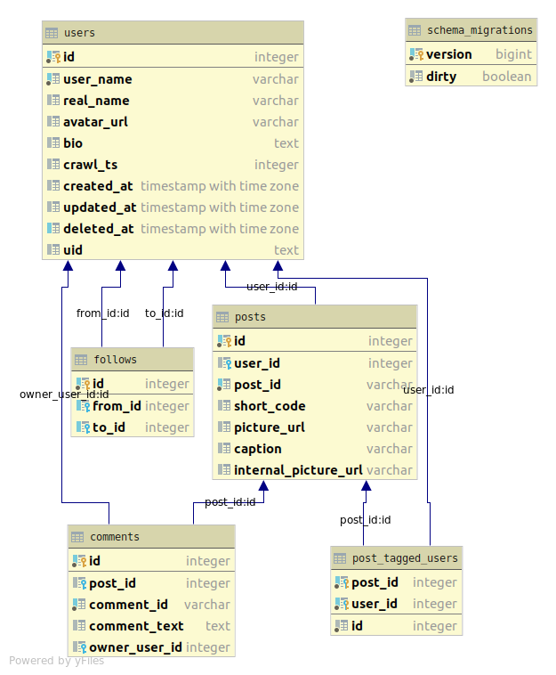
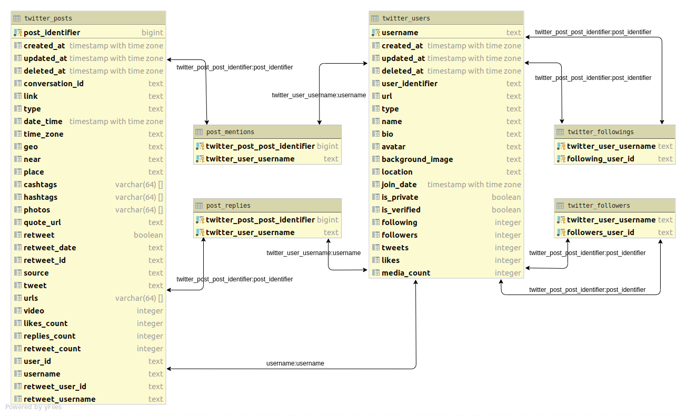

# postgres database

We are using [POSTGRESQL](https://www.postgresql.org/) as the store for the raw scraped data from the various data sources. <br>
The schemas are quite similar to the scraped data structures.

**Table of Contents**

- [Instagram](#instagram)
  - [Remarks](#remarks)
- [Twitter](#twitter)
- [Debezium](#debezium)

## [Instagram](https://www.instagram.com/)

This database is the more sophisticated one and is running in production.



### Remarks

- `internal_picture_url` is pointing to the downloaded picture on S3

## Twitter

This database is not in production yet and at the moment only dumps the tweaked scraped data.



## Debezium

The [debezium](https://github.com/debezium/debezium) connector generates a change stream from all change events in postgres (`read`, `create`, `update`, `delete`) and writes them into a kafka-topic `"postgres.public.<table_name>"`

To read from this stream you can:

- get [`kafkacat`](https://github.com/edenhill/kafkacat)
- inspect the topic list in kafka:
  ```bash
  $ kafkacat -L -b my-kafka | grep 'topic "postgres'
  ```
- consume a topic with
  ```bash
  $ kafkacat -b my-kafka -t <topic_name>
  ```

The messages are quite verbose, since they include their own schema description. The most interesting part is the `value.payload`:

```bash
$ kafkacat -b my-kafka -topic postgres.public.users | jq '.value | fromjson | .payload'`
```
