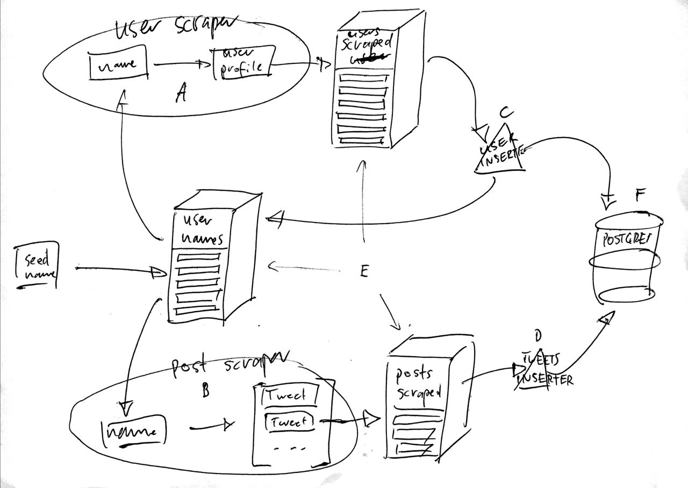

# smag-twitterscraper

- [about](#about)
- [getting started](#getting-started)

## about
Reads user_names from kafka topic `user_names`, scrapes and inserts user-profiles (kafka-topic: `users_scraped`) and tweets (kafka-topic: `tweets_scraped`).  
Then inserters (not there yet) read these information from kafka and insert them into a postgres database.

All of this kinda looks like this:




## getting started
```bash
$ docker-compose up
```
